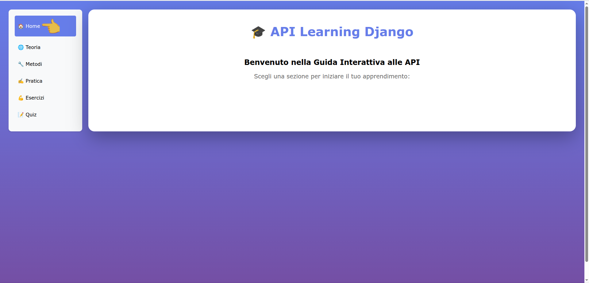
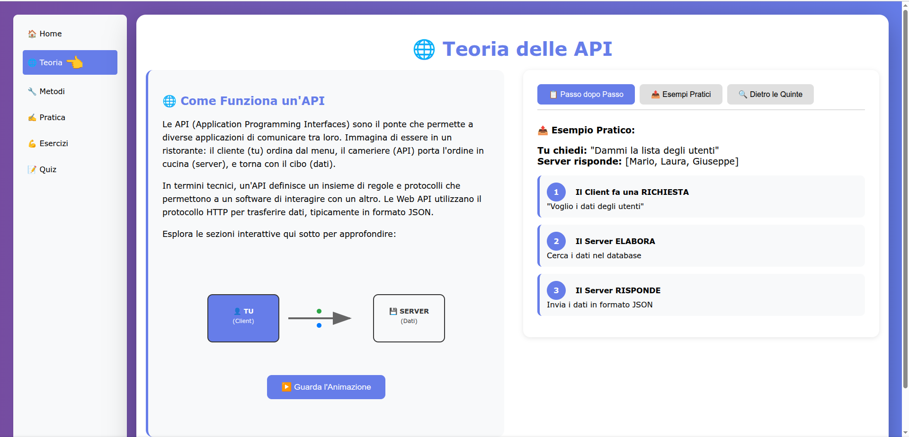
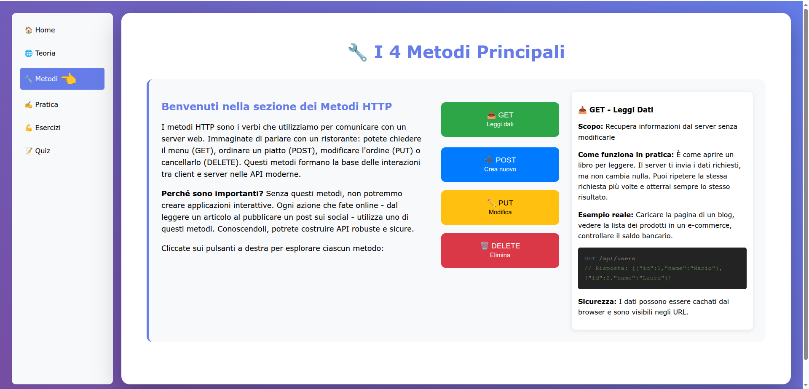
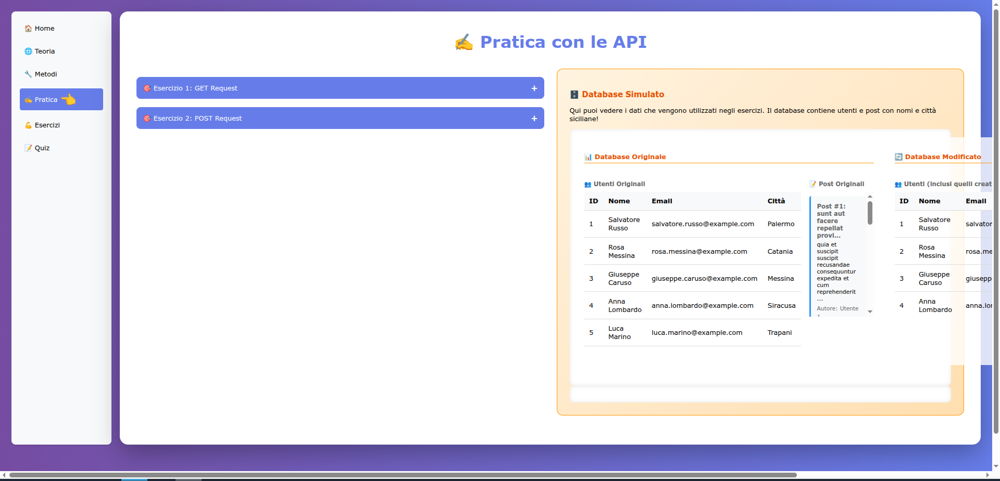
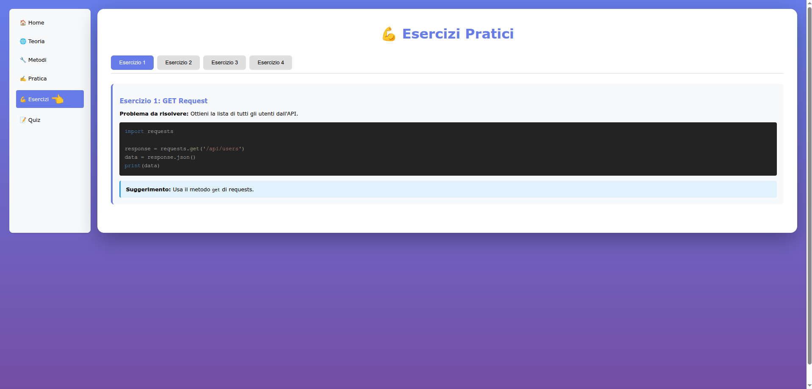
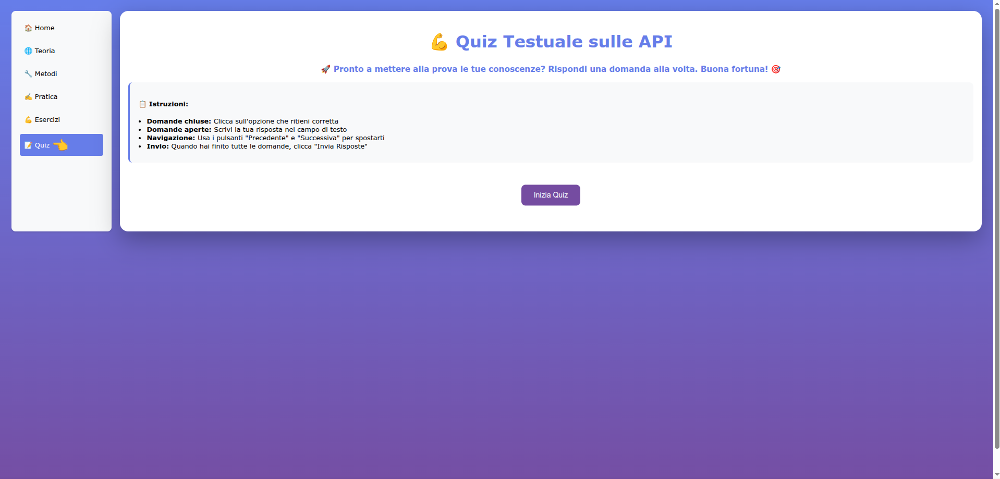
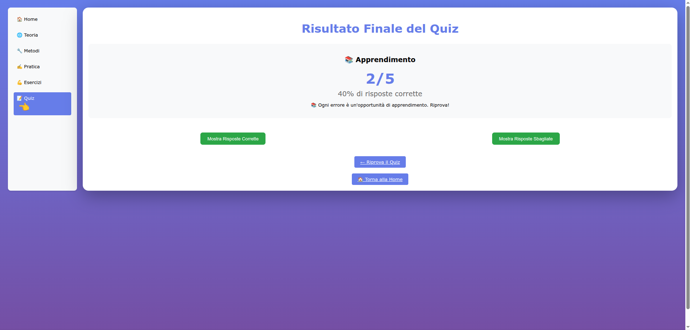

# 🚀 API Learning Django - Piattaforma Interattiva per Apprendere le API Web

[](https://www.djangoproject.com/)
[](https://www.python.org/)
[](LICENSE)

> **Un'applicazione web interattiva creata con AI per migliorare le competenze nelle API web attraverso esercizi pratici, teoria e quiz.**

## 📖 Descrizione

**API Learning Django** è una piattaforma educativa completa progettata per aiutare sviluppatori e studenti a comprendere e padroneggiare le API web. Attraverso un approccio pratico e interattivo, il progetto guida l'utente dalla teoria di base fino all'implementazione pratica.

### 🎯 Obiettivi di Apprendimento
- Comprendere i fondamenti delle API REST
- Imparare i metodi HTTP (GET, POST, PUT, DELETE)
- Sperimentare con chiamate API reali
- Analizzare strutture JSON
- Implementare sicurezza nelle API

## 📸 Anteprima Applicazione

### Screenshot dell'applicazione in funzione:

#### 🏠 Homepage


#### 🌐 Pagina Teoria


#### 🔧 Metodi HTTP


#### ✍️ Pagina Pratica (10 Esercizi)


#### 📝 Quiz Interattivo


#### 📊 Risultati Quiz


#### 👑 Admin Interface


#### 🎯 Database Comparison


#### 📈 Final Interface


> **💡 Tutti gli screenshot sono disponibili nella cartella [SCREENSHOT_software/](SCREENSHOT_software/)**

---

## 🌐 Demo Online (Opzionale)

Se vuoi vedere l'applicazione in funzione **senza installarla**, puoi:

1. **Visitare il repository:** [API_Study_with_Django](https://github.com/wildlux/API_Study_with_Django)
2. **Scarica gli screenshot** dalla cartella `SCREENSHOT_software/`
3. **Guarda i video demo** (se disponibili)

**L'applicazione è progettata per funzionare localmente** sul tuo computer per garantire privacy e sicurezza.

---

## ✨ Caratteristiche Principali

### 🏠 **Home Page**
- Landing page accattivante con navigazione intuitiva
- Panoramica delle sezioni disponibili
- Design responsive con animazioni CSS

### 🌐 **Sezione Teoria**
- Spiegazione interattiva del funzionamento delle API
- Animazione SVG client-server
- Approfondimento sui "dietro le quinte" delle API
- Concetti di business logic e architettura

### 🔧 **Metodi HTTP**
- Spiegazione dettagliata di GET, POST, PUT, DELETE
- Esempi pratici per ogni metodo
- Modal interattivi con codice Python
- Casi d'uso reali

### ✍️ **Sezione Pratica**
- **Esercizio 1**: Richiesta GET interattiva
- **Esercizio 2**: Creazione utente con POST
- **Esercizio 3**: Analisi struttura JSON
- **Esercizio 4**: Sicurezza e autenticazione API
- **Database Simulator**: Visualizzazione dati utenti/post siciliani

### 💪 **Esercizi di Codice**
- Esempi Python completi per ogni metodo HTTP
- Sintassi evidenziata
- Codice pronto per essere copiato e testato

### 📝 **Quiz Interattivo**
- 5 domande a scelta multipla e aperta
- Barra di progresso visiva
- Navigazione tra domande
- Risultati dettagliati con spiegazioni
- **Admin Interface**: Modifica domande tramite Django Admin

## 🚀 Installazione e Avvio

### 📋 Prerequisiti
- **Python 3.8+**
- **Git**
- **Browser web moderno**

### ⚡ Avvio Rapido (Raccomandato)

#### Opzione 1: Script Python Completo
```bash
# Clona il repository
git clone https://github.com/wildlux/API_Study_with_Django.git
cd API_Study_with_Django

# Avvia automaticamente (crea venv, installa dipendenze, avvia server)
python start_django_project.py
```

#### Opzione 2: Script Bash Semplice
```bash
./avvia_progetto.sh
```
*Perfetto per utenti che preferiscono script leggeri o hanno già un ambiente configurato.*

#### Opzione 3: Installazione Manuale
```bash
# 1. Crea ambiente virtuale
python -m venv venv
source venv/bin/activate  # Su Windows: venv\Scripts\activate

# 2. Installa dipendenze
pip install django requests

# 3. Vai nella directory del progetto
cd api_learning_django

# 4. Esegui migrazioni
python manage.py migrate

# 5. Avvia il server
python manage.py runserver
```

### 🌐 Accesso all'Applicazione
Una volta avviato, apri il browser e vai a: **http://127.0.0.1:8000/**

## 📚 Come Utilizzare

### 🧭 Navigazione
1. **Inizia dalla Home** per avere una panoramica
2. **Leggi la Teoria** per capire i fondamenti
3. **Esplora i Metodi HTTP** per imparare le operazioni CRUD
4. **Prova la Pratica** con esercizi interattivi
5. **Studi gli Esercizi** per esempi di codice
6. **Testa le tue conoscenze** con il Quiz

### 🎮 Esercizi Interattivi
- **Database Simulator**: Visualizza dati reali da API esterne
- **Chiamate API Live**: Testa richieste reali a JSONPlaceholder
- **Feedback Istantaneo**: Risposte immediate alle tue azioni

### 📊 Quiz Features
- Navigazione domanda per domanda
- Progress tracking visivo
- Risultati dettagliati
- Spiegazioni per risposte errate

### 👑 **Django Admin Interface**
- **Gestione Domande Quiz**: Aggiungi, modifica, elimina domande
- **Interfaccia User-Friendly**: Form intuitivi per creare contenuti
- **Ricerca e Filtri**: Trova facilmente le domande
- **Ordinamento**: Gestisci l'ordine delle domande

#### Accesso Admin:
```
Username: admin
Password: admin123
URL: http://127.0.0.1:8000/admin/
```

#### Come Modificare le Domande:
1. Accedi a `/admin/` con le credenziali sopra
2. Clicca su "Learning > Questions"
3. Aggiungi/modifica domande esistenti
4. Salva e testa nel quiz

## 🛠️ Tecnologie Utilizzate

| Tecnologia | Versione | Scopo |
|------------|----------|--------|
| **Django** | 4.2+ | Framework web backend |
| **Python** | 3.8+ | Linguaggio di programmazione |
| **HTML5** | - | Struttura delle pagine |
| **CSS3** | - | Styling e animazioni |
| **JavaScript** | ES6+ | Interattività frontend |
| **JSONPlaceholder** | - | API di test esterna |
| **SQLite** | - | Database locale |

## 📁 Struttura del Progetto

```
API_Study_with_Django/
├── api_learning_django/          # ⚙️ Progetto Django principale
│   ├── manage.py                # Script di gestione Django
│   ├── db.sqlite3               # Database con domande quiz
│   ├── api_learning_django/     # Configurazioni core
│   └── learning/                # 🧠 App principale
│       ├── models.py           # Modello Question
│       ├── views.py            # Logica delle pagine
│       ├── templates/          # Template HTML
│       ├── static/             # File statici (CSS/JS)
│       └── admin.py            # Interfaccia amministratore
├── SCREENSHOT_software/         # 📸 Screenshots dell'applicazione
├── venv/                        # Ambiente virtuale Python
├── archive/                     # File di sviluppo archiviati
├── start_django_project.py      # 🚀 Avviatore automatico Python
├── avvia_progetto.sh           # 🐚 Script bash per avvio rapido
└── README.md                   # 📖 Questa documentazione
```

## 🎓 Esempi di Utilizzo

### Creare una Richiesta GET
```python
import requests

# Esempio dal sito
response = requests.get('https://jsonplaceholder.typicode.com/users')
data = response.json()
print(f"Recuperati {len(data)} utenti")
```

### Creare una Richiesta POST
```python
import requests

# Esempio dal sito
user_data = {
    'name': 'Mario Rossi',
    'email': 'mario@example.com'
}
response = requests.post('https://jsonplaceholder.typicode.com/users', json=user_data)
print(f"Utente creato: {response.json()}")
```

## 🤝 Come Contribuire

1. **Fork** il progetto
2. **Crea** un branch per la tua feature (`git checkout -b feature/nuova-funzionalita`)
3. **Commit** le tue modifiche (`git commit -am 'Aggiungi nuova funzionalità'`)
4. **Push** il branch (`git push origin feature/nuova-funzionalita`)
5. **Apri** una Pull Request

### Idee per Contributi
- ➕ Aggiungere più esercizi pratici
- 🎨 Migliorare il design UI/UX
- 🌍 Traduzioni in altre lingue
- 📱 Ottimizzazione mobile
- 🔒 Aggiungere più concetti di sicurezza API

## 📄 Licenza

Questo progetto è distribuito sotto licenza **MIT**. Vedi il file `LICENSE` per maggiori dettagli.

## 🙏 Riconoscimenti

- **Creato con AI** per migliorare le competenze di sviluppo web
- **Ispirato** dalla necessità di risorse educative pratiche per le API
- **Utilizza** JSONPlaceholder per esempi API reali
- **Realizzato** con Django per un'esperienza web robusta

## 📞 Supporto

Se hai domande o problemi:
- 📧 **Email**: wildlux@gmail.com
- 🐛 **Issues**: [GitHub Issues](https://github.com/wildlux/API_Study_with_Django/issues)
- 📖 **Wiki**: [Documentazione](https://github.com/wildlux/API_Study_with_Django/wiki)

---

## 🎯 Pronto per Imparare?

🚀 **Avvia il progetto ora e inizia il tuo viaggio nel mondo delle API!**

```bash
git clone https://github.com/wildlux/API_Study_with_Django.git
cd API_Study_with_Django
python start_django_project.py
```

*Buon apprendimento! 🎓✨*